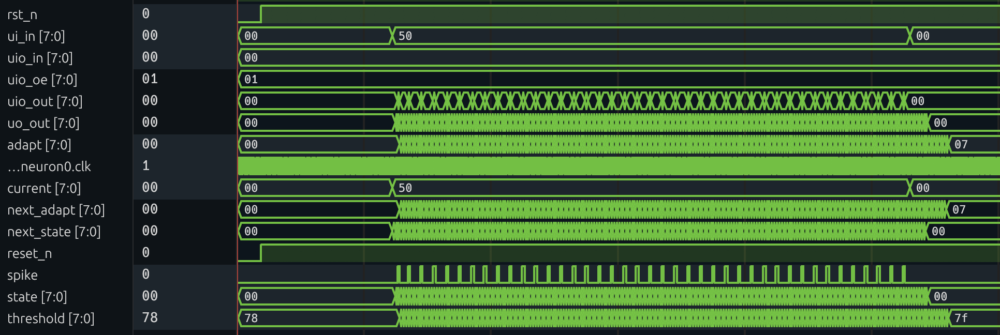

<!---

This file is used to generate your project datasheet. Please fill in the information below and delete any unused
sections.

You can also include images in this folder and reference them in the markdown. Each image must be less than
512 kb in size, and the combined size of all images must be less than 1 MB.

INCLUDE IMAGES HERE
-->

## How it works

This project implements an 8-bit **Adaptive Leaky Integrate-and-Fire (ALIF)** neuron in digital logic.

```
           +----------------+
Input --->| Integrate + Leak |----> Compare ---> Spike
           +----------------+         ^
                                      |
                                  Dynamic
                                  Threshold
                                      ^
                                      |
                                 Adaptation
                                 (decay + spike boost)
```

Each clock cycle, the input value on `ui[7:0]` is interpreted as an injected input current. The neuron updates its internal membrane state according to:

```verilog
assign next_state = current + (state >> 1);
```

This models:

- Integration of input current  
- Leakage (the membrane voltage decays by 50% each cycle)
- Using 50% as it maps easily to hardware

The neuron compares the membrane state against a **dynamic threshold**, but first calculates the full threshold and checks if the carry is 1, and then saturates:

```verilog
assign carry_threshold = BASE_THRESHOLD + adapt;
assign threshold = (carry_threshold[8]) ? 8'd255 : BASE_THRESHOLD + adapt;
```

Where:
- `BASE_THRESHOLD` is a constant
- `adapt` is the adaptation variable

If:
```verilog
state >= threshold
```
then:

- A one-cycle spike pulse is emitted on `uio[0]`
- The membrane state resets to `RESET_VALUE`
- The adaptation variable increases by `ADAPT_STEP`

The adaptation variable decays gradually over time:

```verilog
assign adapt_next = adapt - (adapt >> 3)
```

This models:
- Adapation decay
- Avoids multipliers
- Provides a slow decay

This creates the adaptation, where the neuron fires quickly at first, then firing slows under sustained stimulation, eventually stabilizes to a steady firing rate. This behavior is meant to mimic biological neurons that become temporarily less excitable after each spike.

## How to test

Using the provided cocotb testbench, so run:

```bash
make -B
```

It has 5 tests
The testbench includes 6 automated tests that verify:

0. Reset
1. No spontaneous spike
2. Constant input causes spike
3. Reset behavior after spike
4. Adaptation limits firing rate
5. Nothing after removing input



## External hardware

The design only needs:
- Clock
- Reset
- 8-bit input current
